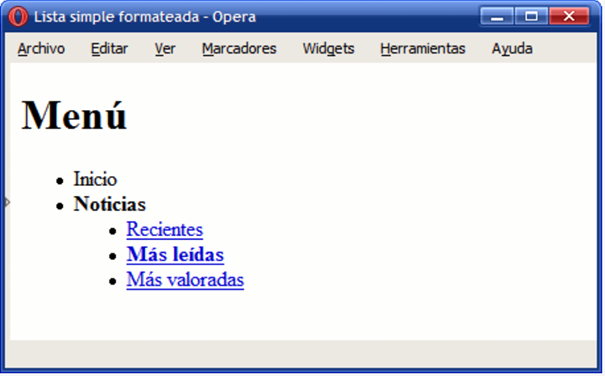
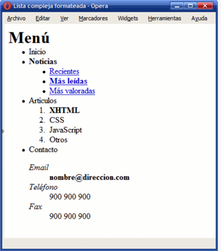
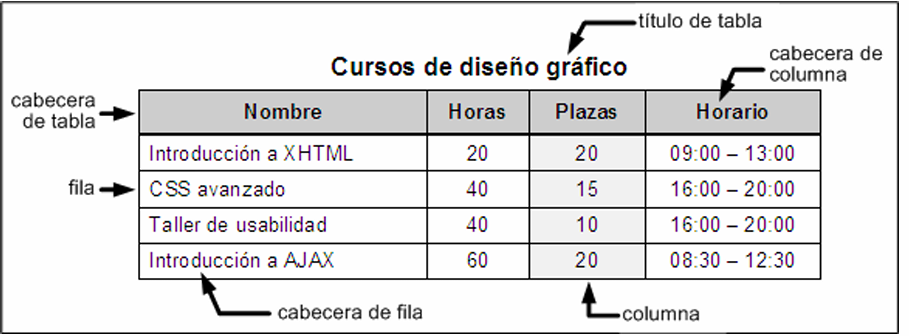
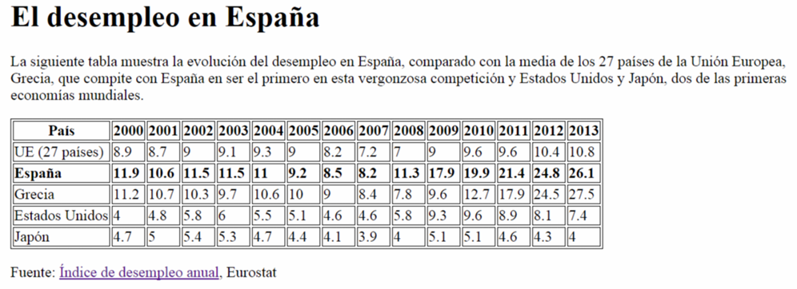
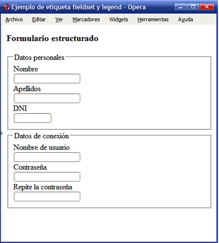
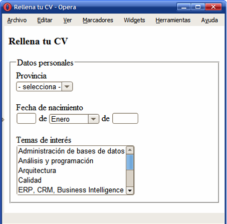
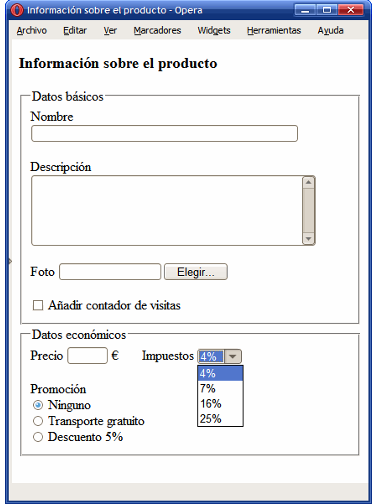

# Ejercicios de HTML

## Tarea 5.1

Utilizando las etiquetas que hemos visto en esta clase,
realizar un documento html usando la plantilla boilerplate del
tema pasado, que tenga el siguiente aspecto.

[Click para ver la tarea 5.1](https://github.com/Ernott/ernott-html-ejercicios/tree/main/archivos_ejercicios/tarea5_1)

## Tarea 5.2

Utilizando las etiquetas vistas en clase y los enlaces, intentar
crear un documento con ejemplos de cada tipo de etiqueta y
enlazarlos en un documento inicial parecido a los que os
enseño yo en la clase. Enlazar el documento creado en la
tarea 5.1 también en la lista de enlaces.

[Click para ver la tarea 5.2](https://github.com/Ernott/ernott-html-ejercicios/tree/main/archivos_ejercicios/tarea5_2)

## Tarea 6.1

Utilizando las etiquetas vistas en clase, realizar a traves de **Figma** la identificacion de las etiquetas semánticas de 3 páginas web.

_He realizado 3 portafolios de devs que encontré en el servidor de MoureDev, aquí les dejo los enlaces:_

Erick Taveras: https://www.eriktaveras.com/

Scarleth San Martin: https://scarlethsmlportafolio.netlify.app/

Maverich Champi: https://maverickchampi.vercel.app/

[Click para ver la tarea 6.1](https://www.figma.com/design/q3PiYhVbnxCML30SxCC3v4/Tarea6_1?node-id=0-1&t=iyMjHibTL6xk6184-1)

## Tarea 7.1

Realizar un documento por cada enunciado para poder practicar las listas de elementos

### Ejercicio 1

Haz una lista ordenada de los cinco primeros países que vas a visitar en los próximos años. En la lista ordenada usarás números

### Ejercicio 2

Utilizando el ejercicio anterior, invierte el orden de los números

### Ejercicio 3

Haz una lista desordenada de tus películas favoritas

### Ejercicio 4

Haz un documento por cada imagen de las que te muestro a continuación:

[Click para ver la tarea 7.1](https://github.com/Ernott/ernott-html-ejercicios/tree/main/archivos_ejercicios/tarea7_1)

## Tarea 8.1

Realizar las siguientes tablas a modo de práctica

[Click para ver la tarea 8.1](https://github.com/Ernott/ernott-html-ejercicios/tree/main/archivos_ejercicios/tarea8_1)

## Tarea 12.1

Crea una página web que contenga un formulario con los siguientes
campos de información

- El nombre, con un control de tipo texto
- Los apellidos, con un control de tipo texto
- El sexo, con dos opciones excluyentes hombre o mujer
- El correo electrónico, con un control de tipo email
- Una casilla de verificación con el texto "Deseo recibir información sobre
  novedades y ofertas"
- Una casilla de verificación con el texto "Declaro haber leido y aceptar las
  condiciones generales del programa y la normativa sobre protección de
  datos"
- Un botón de envío
- Población, una lista desplegable con las opciones Alicante, Madrid,
  Sevilla y Valencia
- Descripción, un área de texto multilínea
- Además, tienes que asociar la etiqueta de cada control a su control para
  mejorar la usabilidad y la accesibilidad.
- Además, tienes que tener en cuenta los siguientes requisitos
- El título de la página debe ser Formulario de registro - Mi web
- El método de envío del formulario debe ser GET
- El destino del envío del formulario debe ser ""
- La longitud máxima de entrada de datos de los controles para el nombre
  y los apellidos debe ser 50 caracteres
- La casilla de verificación con el texto "Deseo recibir información sobre
  novedades y ofertas" debe estar activada por defecto

## Tarea 12.2

## Tarea 12.3

## Tarea 12.4

[Click para ver la tarea 12](https://github.com/Ernott/ernott-html-ejercicios/tree/main/archivos_ejercicios/tarea12_1)
